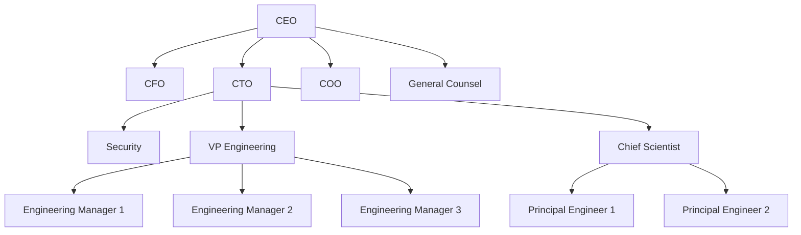

# Project Plan for ClawTeam

## Summary

ClawTeam is a tool to organize and manage Krab migrations and automation for PostgreSQL databases.

## Goals

- Provide a user-friendly interface for managing Krab configurations.
- Support organizational workflows for database migrations.
- Integrate with existing Krab tools.

## Features

- Migration planning and organization.
- Configuration management.
- Reporting and monitoring.

## Timeline

- Phase 1: Initial setup and basic features.
- Phase 2: Advanced organizational features.
- Phase 3: Integration and testing.

## Resources

See [Krab on GitHub](https://github.com/ohkrab/krab) for the underlying tool.

## Organizational Structure

